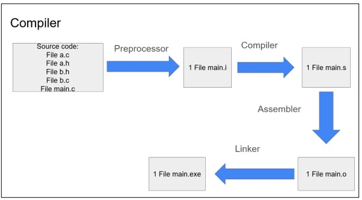
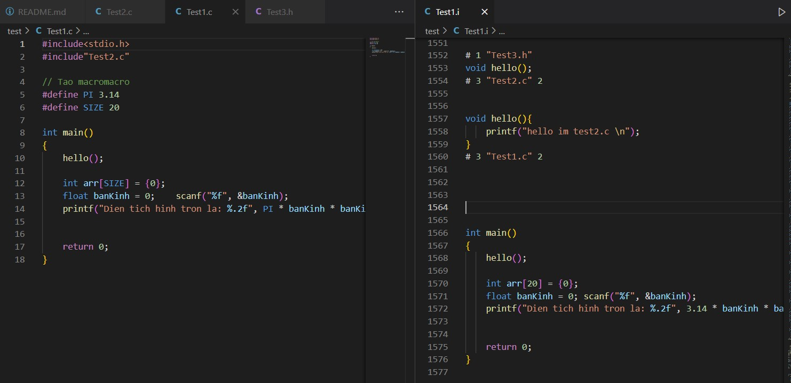
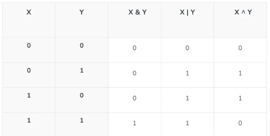

# Advance_C_Cpp
Contents

<details>
<summary>LESSON 1: COMPILER - MACRO</summary> 

---


## I. COMPILER
### 1. ĐỊNH NGHĨA 
#### 1.1Quá trình biên dịch
    Quy trình dịch là quá trình chuyển đổi từ ngôn ngữ bậc cao(NNBC) 
    (C/C++, Pascal, Java, C#…) sang ngôn ngữ đích (ngôn ngữ máy) để 
    máy tính có thể hiểu và thực thi.
#### Quá trình biên dịch gồm 4 giai đoạn
    1. Giai đoạn tiền xử lý (Pre-processor).
    2. Giai đoạn dịch NNBC sang Asembly (Compiler).
    3. Giai đoạn dịch asembly sang ngôn ngữ máy (Asembller).
    4. Giai đoạn liên kết (Linker).
   
   
### 1.2 HOẠT ĐỘNG 

   ***1. Giai đoạn tiền xử lý - Preprocessor***

    - Nhận mã nguồn.
    - Xóa bỏ chú thích, comments của chướng trình.
    - Chỉ thị tiền xử lý(bắt đầu bằng dấu #) cũng được xử lý.
    - Gộp các file .c, .h ... thành 1 file .i .
    - Giữ lại các biến và hàm.
    - Dùng lệnh: gcc -E main.c -o main.i 
   
   Ví dụ: 
   
   Giải thích: Nội dung của thư viện stdio.h và nội dung của file Test.c sẽ được copy vào file Test1.i, 
   các macro define sẽ được thay thế và giữ lại các biến và hàm.

   ***2. Compiler (Giai đoạn dịch NNBC sang ngôn ngữ Assembly):***

    - Quá trình này compiler sẽ biên dịch từ file .i sang file ngôn ngữ assembly là file .s
    - Dùng lệnh gcc -S main.i -o main.s
   ***3. Assembler (Giai đoạn dịch ngôn ngữ Assembly sang ngôn ngữ máy):*** 

    -   Compiler sẽ Biên dịch ngôn ngữ Assembly sang ngôn ngữ máy (0 và 1). Và tạo ra tệp tin Object .o
    -   Dùng lệnh gcc -c main.s -o main.o để tạo ra file .o
   ***4. Linker (Giải đoạn liên kết):***

    -   1 hoặc nhiều file.o sẽ được compiler liên kết lại 1 File .exe.
    -   File này để hệ điều hành chạy
    -   Dùng lệnh gcc main.o -o filename để tạo ra tệp thực thi .

## II. MACRO
### 1. ĐỊNH NGHĨA 

    Trong ngôn ngữ lập trình C, macro là một cách để định nghĩa một khối mã nguồn mà có thể được sử dụng 
    nhiều lần trong chương trình. Macro được xác định bằng cụm từ #define trong C. Khi chương trình được
    biên dịch, macro sẽ được thay thế bằng nội dung mà nó định nghĩa, trước khi mã nguồn được biên dịch.

    Macro trong C gồm: 1. Chỉ thị bao hàm tệp
                       2. Chỉ thị định nghĩa
                       3. Chỉ thị biên dịc có điều kiện
                        ......

#### 1.1 Chỉ thị bao hàm tệp 

    Trong ngôn ngữ lập trình C, chỉ thị để bao hàm một tệp vào một
    chương trình là chỉ thị tiền xử lý #include. Chỉ thị này cho 
    phép bạn bao gồm nội dung của một tệp header vào trong mã nguồn
    của bạn trước khi chương trình được biên dịch.

    1. Bao hàm tệp header bằng <>: 

        Khi bạn sử dụng #include <header.h>, trình biên dịch sẽ tìm
        kiếm tệp header trong các thư mục chuẩn của hệ thống. 
        Ví dụ: #include <stdio.h>, #include <math.h> ...
    2. Bao hàm tệp header bằng "":
   
        Khi bạn sử dụng #include "header.h", trình biên dịch sẽ tìm 
        kiếm tệp header trong cùng thư mục với tệp mã nguồn hiện tại 
        trước khi tìm trong các thư mục khác. Điều này thường được 
        sử dụng cho các tệp header do người dùng tạo ra hoặc tùy chỉnh.
        Ví dụ: #include "myheader.h", ....
#### 1.2 Chỉ thị định nghĩa macro

    Chỉ thị #define được sử dụng để định nghĩa macro. 
-   Định nghĩa một hằng số
-   Định nghĩa một chuỗi
-   Định nghĩa hàm (chú ý dấu \ sau mỗi dòngdòng)
    ......

```c
#include<stdio.h>
#include"Test2.c"

#define PI 3.14     //Dinh nghia 1 hang so
#define SIZE 20     //Dinh nghia 1 so
#define CHUOI "Hello World"         //Dinh nghia 1 chuoi

// Dinh nghia 1 ham
#define FUNC(name, cmd) \
void name(){            \
    printf("cmd");      \
}

FUNC(Test11, "My name is Trong");

```
Trong đoạn code này: 
- Định nghĩa các hằng số PI, SIZE, và chuỗi CHUOI sử dụng #define.
- Sử dụng macro FUNC để định nghĩa một hàm với tên và nội dung được truyền vào như tham số.

#### 1.3 Chỉ thi hủy định nghĩa một macro

    Khi bạn sử dụng chỉ thị #define, bạn tạo ra một macro mà trình biên dịch sẽ thay thế tất
    cả các trường hợp của macro đó trong mã nguồncủa bạn bằng nội dung mà bạn đã định nghĩa. 
    Khi bạn muốn loại bỏhoặc hủy bỏ định nghĩa của một macro, bạn có thể sử dụng chỉ thị #undef.

```c
#include <stdio.h>

#define PI 3.14159  // Định nghĩa macro PI

int main() {
    printf("Value of PI: %f\n", PI);  // Sử dụng macro PI

    #undef PI  // Hủy định nghĩa macro PI
    #define PI 55 // Định nghĩa lại macro PI
    printf("Value of PI after undef: %f\n", PI);// PI hiện tại bằng 5

    return 0;
}
```
Trong đoạn code trên:
- Chúng ta định nghĩa macro PI với giá trị ban đầu là 3.14159.
- Sau đó, chúng ta sử dụng macro PI để in ra giá trị của PI.
- Tiếp theo, chúng ta hủy định nghĩa của macro PI bằng #undef và định nghĩa lại nó với giá trị 55.
- Cuối cùng, chúng ta in ra giá trị mới của PI sau khi định nghĩa lại, là 55.

#### 1.4 Chỉ thị biên dịch có điều kiện

    -  #ifdef và #ifndef: Kiểm tra xem một macro đã được định nghĩa hay chưa.
    -  #ifdef MACRO: Kiểm tra xem macro MACRO đã được định nghĩa hay chưa.
    -  #ifndef MACRO: Kiểm tra xem macro MACRO chưa được định nghĩa.
  
***Ví dụ sử dụng #ifdef và #endif:***

```c
#include <stdio.h>

#define PI 3.14  // Định nghĩa macro PI

int main() {
    #ifdef PI
        printf("PI = 3.14\n");
    #endif

    return 0;
}
```
Trong ví dụ trên:
- Macro PI được định nghĩa với giá trị 3.14.
- Sử dụng #ifdef để kiểm tra xem macro PI có được định nghĩa hay không. 
Nếu có, dòng "PI = 3.14 " sẽ được in ra.
- Chương trình sẽ kết thúc sau khi in ra thông báo và trả về giá trị 0.
- 
***Ví dụ sử dụng #ifdef và #endif:***

```c
#include <stdio.h>

#ifndef PI
#define PI 3.14159
#endif

int main() {
    printf("The value of PI is: %f\n", PI);

    return 0;
}

```
Chỉ thị #ifndef PI kiểm tra xem macro PI đã được định nghĩa hay chưa. Nếu PI 
chưa được định nghĩa, khối mã trong #ifndef sẽ được thực thi và macro PI sẽ 
được định nghĩa với giá trị là 3.14 .


2. #if, #elif, #else, #endif: Thực hiện biên dịch dựa trên giá trị của các biểu thức.

    -   #if condition: Biên dịch nếu điều kiện là đúng.
    -   #elif condition: Biên dịch nếu điều kiện trước đó sai và điều kiện hiện tại đúng.
    -   #else: Biên dịch nếu tất cả các điều kiện trước đó đều sai.
    -   #endif: Kết thúc một khối điều kiện.

***Ví dụ sử dụng #if, #elif, #else, #endif***

```c
#include <stdio.h>

#define ESP32 1
#define STM32 2
#define ATmega 3

#define MCU STM32

int main(int argc, char const *argv[])
{
    while (1)
    {
        #if MCU == STM32
            printf("STM32\n");
        
        #elif MCU == ESP32
            printf("ESP32\n");
        
        #elif MCU == ATmega
            printf("ATmega\n");

        #else 
            printf("Unknown MCU\n");

        #endi
    }
    return 0;
}
```
Trong đoạn code trên:
- Các macromacro ESP32, STM32 và ATmega được định nghĩa.
- Macro MCU được đặt là STM32.
- Trong vòng lặp while, chúng ta sử dụng các điều kiện #if, #elif, và #else để in ra tên của 
vi điều khiển tương ứng với giá trị của MCU.
- Cuối cùng, chúng ta sử dụng #endif để kết thúc các điều kiện tiền xử lý.
#### 1.5 Variadic macro
    Variadic macros trong ngôn ngữ lập trình C cho phép bạn định nghĩa cácmacro có số lượng
    tham số biến đổi. Điều này có nghĩa là số lượng tham số của macro có thể thay đổi khi được
    sử dụng. Để định nghĩa một macro biến tham số, bạn sử dụng ... để chỉ ra số lượng tham số 
    có thể biến đổi.


```c
#include <stdio.h>

#define NUMBER(...) printf(__VA_ARGS__)

int main() {
    NUMBER("Value of x: %d, y: %f\n", 10, 3.14);
    return 0;
}
```
Trong ví dụ trên: 
-   Macro NUMBER được định nghĩa với tham số biến đổi ....
-   Bên trong macro, chúng ta sử dụng __VA_ARGS__ để truy cập đến các tham số được truyền vào macro.
-   Khi chúng ta sử dụng macro NUMBER với các đối số khác nhau, nó sẽ in ra các giá trị tương ứng một cách linh hoạt.

</details>

<details>
<summary>LESSON 2: STDARG - ASSERT</summary>

## THƯ VIỆN STDARG
    Thư viện stdarg.h trong ngôn ngữ lập trình C cung cấp chức năng để làm
    việc với các hàm có số lượng đối số biến đổi.Trong stdarg.h, có các cấu
    trúc quan trọng như va_list, va_start, va_arg, và va_end: 
    -   va_list: Đây là một kiểu dữ liệu để lưu trữ các tham số biến đổi.
    -   va_start: Hàm này được sử dụng để khởi tạo va_list và thiết lập con trỏ đến tham số đầu tiên.
    -   va_arg: Hàm này được sử dụng để truy xuất các tham số tiếp theo trong danh sách tham số biến đổi.
    -   va_end: Hàm này được sử dụng để kết thúc việc truy cập các tham số biến đổi.

```C
#include <stdio.h>
#include <stdarg.h>

int sum(int count, ...) {
    va_list args;
    va_start(args, count);

    int total = 0;
    for (int i = 0; i < count; i++) {
        total += va_arg(args, int);
    }

    va_end(args);

    return total;
}

int main() {
    int result1 = sum(3, 10, 20, 30);
    int result2 = sum(5, 1, 2, 3, 4, 5);

    printf("Sum 1: %d\n", result1);
    printf("Sum 2: %d\n", result2);

    return 0;
}
```

Trong ví dụ này:
-   Hàm sum nhận một số nguyên đầu tiên (count) để xác định số lượng đối số tiếp -  theo cần tính tổng.
-   Trong hàm sum, chúng ta sử dụng va_list, va_start và va_arg để truy cập các đối số biến đổi và tính tổng của chúng.
-   Cuối cùng, chúng ta gọi hàm sum với số lượng đối số khác nhau và in ra kết quả.

```C
#include <stdio.h>
#include <stdarg.h>

#define tong(...) sum(__VA_ARGS__, 0)

int sum(int count,...)
{
    va_list args;

    va_start(args, count);

    int result = count; // bắt đầu tính tổng từ count
    int value;

    while((value = va_arg(args, int)) != 0)
    {
        result += value;
    }

    va_end(args);

    return result;
}

int main(int argc, char const *argv[])
{
    printf("Tong = %d\n", tong(3, 2, 4, 5, 7)); // sum(3, 2, 4, 5, 7, 0)
    return 0;
}
```

Trong ví dụ này ta sử dụng một các tối ưu hơn là: 
- Định nghĩa macro ***#define tong(...)  sum(VA_ARGS, 0)*** để gọi hàm sum với các tham số mà macro tong nhận được và thêm một số 0 vào cuối danh sách tham số.
***Nhược điểm***: Vòng lặp tính tổng sẽ dừng nếu gặp số 0, mà sẽ không xét đến các số tiếp theo nếu có.

```c
#include <stdio.h>
#include <stdarg.h>

#define tong(...) sum(__VA_ARGS__, '\n')

int sum(int count,...)
{
    va_list args;
    va_list check;

    va_start(args, count);

    va_copy(check, args);

    int result = count; 

    while(( va_arg(check, char*)) != (char*)'\n')
    {
        result += va_arg(args, int);
    }

    va_end(args);

    return result;
}

int main(int argc, char const *argv[])
{
    printf("Tong = %d\n", tong(3, 10, 4, 0, 5)); 
    return 0;
}
```
Trong đoạn code này sẽ khắc phục lỗi của cả 2 ví dụ trên: 

***Sử dụng ký tự '\n' thay vì số 0:***
-   Trong ví dụ mới,sử dụng ký tự '\n' để đánh dấu kết thúc danh sách tham số 
thay vì sử dụng số 0 như trong ví dụ trước đó. Điều này giúp vòng lặp sẽ duyệt
tới vị trí cuối cùng của dãy số truyền vào.

***Sử dụng va_copy để sao chép danh sách tham số:***
-   Trong hàm sum, sử dụng ***va_copy*** để sao chép danh sách tham số (args) sang một 
biến khác (check). Điều này giúp bạn kiểm tra điều kiện kết thúc vòng lặp mà không 
thay đổi vị trí của con trỏ trong danh sách tham số chính.(Vì mỗi lần gọi hàm ***va_arg***
sẽ trỏ tới một số.)

***Điều kiện dừng vòng lặp trong hàm sum:***
-   Trong vòng lặp while, kiểm tra điều kiện dừng bằng cách so sánh giá trị của tham số hiện tại 
trong danh sách (va_arg(check, char*)) với ký tự '\n'. Khi gặp ký tự '\n', vòng lặp sẽ dừng.

## THƯ VIỆN ASSERT
- Dùng để phát hiện lỗi, debug chương trình, thể hiện lỗi cụ thể trong code.
- Nếu điều kiện đúng (true), chương trình được thực thi.
- Nếu điều kiện sai (false), chương trình báo lỗi và sẽ sừng lại.

```c
#include <stdio.h>
#include <assert.h>
int main() {
   int x = 88;

   assert(x == 88);

   // Chương trình sẽ tiếp tục thực thi nếu điều kiện là đúng, và ngược lại.
   printf("X is: %d", x);
   
   return 0;
}
```
Trong đoạn code này điều kiện *** x = 88 *** là đúng nên chương trình sẽ thực thi.

```c
    #include <stdio.h>
#include <assert.h>
int main() {
   int x = 5;

   assert(x == 1010);

   // Chương trình sẽ tiếp tục thực thi nếu điều kiện là đúng, và ngược lại.
   printf("X is: %d", x);
   
   return 0;
}
```
Trong đoạn code trên biến x không bằng 1010 nên trương trình sẽ gặp lỗi và dừng lại.
***output: Assertion failed: x == 88, file D:\LEARN\CODE_C\ADVANCE_C_Cpp\stdarg.c, line 6***


</details>


<details>
<summary>LESSON 3: BITMASK </summary> 

## Bit mask
- Bitmask là một kỹ thuật sử dụng các bit để lưu trữ và thao tác với các cờ (flags) hoặc trạng thái. Có thể sử dụng bitmask để đặt, xóa và kiểm tra trạng thái của các bit cụ thể trong một từ (word).

- Bitmask thường được sử dụng để tối ưu hóa bộ nhớ, thực hiện các phép toán logic trên một cụm bit, và quản lý các trạng thái, quyền truy cập, hoặc các thuộc tính khác của một đối tượng.
  
***Các phép toán bitwise (thự hiện trên bit)***

***AND (&):***

    - Phép toán AND (và) trên hai bit, trả về 1 nếu cả hai bit đều là 1, ngược lại trả về 0.
***OR (|):***

    - Phép toán OR (hoặc) trên hai bit, trả về 1 nếu một trong hai bit hoặc cả hai bit là 1, ngược lại trả về 0.
***XOR (^):***

    - Phép toán XOR (hoặc loại trừ) trên hai bit, trả về 1 nếu hai bit khác nhau, ngược lại trả về 0.
***NOT (~):***

    - Phép toán NOT (phủ định) hoán đổi các bit, chuyển 0 thành 1 và ngược lại.
***Shift Left (<<):***

    - Phép toán dịch trái, dịch các bit sang trái và điền vào các bit bên phải bằng 0.
***Shift Right (>>):***

    - Phép toán dịch phải, dịch các bit sang phải và điền vào các bit bên trái bằng 0 hoặc 1 (phụ thuộc vào loại dịch).



***Ví dụ***

```c
#include <stdio.h>
int main()
{
    // a = 5 (00000101), b = 9 (00001001 )
    unsigned int a = 5, b = 9;

    printf("a = %u, b = %u\n", a, b);
    printf("a&b = %u\n", a & b);

    printf("a|b = %u\n", a | b);

    printf("a^b = %u\n", a ^ b);

    printf("~a = %u\n", a = ~a);

    printf("b<<1 = %u\n", b << 1);

    printf("b>>1 = %u\n", b >> 1);

    return 0;
}
```

Output:
    a = 5, b = 9

    a&b = 1

    a|b = 13

    a^b = 12

    ~a = 4294967290

    b<<1 = 18
    
    b>>1 = 4

### Thư viên stdint.h 
- Thư viện stdint.h trong C cung cấp các kiểu dữ liệu số nguyên có độ rộng cố định với các kích thước cụ thể, 
  không phụ thuộc vào nền tảng hoặc trình biên dịch cụ thể.
  
  Dưới đây là một số kiểu dữ liệu phổ biến được định nghĩa trong stdint.h:

    ***int8_t, int16_t, int32_t, int64_t:***

    Các kiểu số nguyên có độ rộng cố định với số bit cụ thể (8, 16, 32, 64 bit) và dấu.
    ***uint8_t, uint16_t, uint32_t, uint64_t:***

    Các kiểu số nguyên không dấu có độ rộng cố định với số bit cụ thể (8, 16, 32, 64 bit).

## Ứng dụng bitmask trong thực tế
```c

#include <stdio.h>
#include <stdint.h>


#define GENDER        1 << 0  //0b00000001
#define TSHIRT        1 << 1  //0b00000010
#define HAT           1 << 2  //0b00000100
#define SHOES         1 << 3  //0b00001000
// Tự thêm tính năng khác
#define FEATURE1      1 << 4  //0b00010000
#define FEATURE2      1 << 5  //0b00100000
#define FEATURE3      1 << 6  //0b01000000
#define FEATURE4      1 << 7  //0b10000000

/*
    Sử dụng bit wise | để bật 1 tính năng mà không ảnh hưởng đến bit khác
    ví dụ bật tín năng số 1:
    0b10000000 (option)
    |
    0b00000001 
    ----------
    0b10000001
*/

void enableFeature(uint8_t *option, uint8_t feature) {
    *option |= feature;
}

/*
    Sử dụng bit wise & tắt 1 tính năng mà không ảnh hưởng tới bit khác
    Vi dụ tắt tính năng sô 1:
    0b00000111 (option), 0b00000001(feature), 0b11111110(~feature)
    
    0b00000111(option)
    &
    0b11111110(~feature)
    ----------
    0b00000110
*/

void disableFeature(uint8_t *option, uint8_t feature) {
    *option &= ~feature;
}

// Kiểm tra những bit nao được bật 
int isFeatureEnabled(uint8_t option, uint8_t option) {
    return (option & option) != 0;
}

void listSelectedFeatures(uint8_t option) {
    printf("Selected Features:\n");

    if (option & GENDER) {
        printf("- Gender\n");
    }
    if (option & TSHIRT) {
        printf("- T-Shirt\n");
    }
    if (option & HAT) {
        printf("- Hat\n");
    }
    if (option & SHOES) {
        printf("- Shoes\n");
    }

    for (int i = 0; i < 8; i++)
    {
        printf("feature selected: %d\n", (option >> i) & 1);
    }
    

    // Thêm các điều kiện kiểm tra cho các tính năng khác
}


int main() {
    uint8_t options = 0;

    // Thêm tính năng 
    enableFeature(&options, GENDER | TSHIRT | HAT | SHOES);

    disableFeature(&options, TSHIRT);

    // Liệt kê các tính năng đã chọn
    listSelectedFeatures(options);
    
    return 0;
}

```
Output:
```c
Selected Features:
- Gender
- Hat
- shoesshoes
feature selected: 1
feature selected: 0
feature selected: 1
feature selected: 1
feature selected: 0
feature selected: 0
feature selected: 0
feature selected: 0
```

